# Putting the A in MEAN

> [Back to Main](readme.md)

## Adding Angular to Presidents

In this exercise, our goal is to refactor a full stack express app with server side rendered views, into a Single Page App by adding Angular and using our back-end to render `JSON`.

Solution code for this walkthrough can be found on the `angular-solution` branch of the [whenpresident repo](https://github.com/ga-wdi-exercises/whenpresident/tree/angular-solution)
---

### Setup

We are going to start from the solution code for the Express-Mongoose class, so go ahead and run the below commands to checkout to the starter code for this exercise:

If you want to start fresh, clone down the repo:
```bash
$ git clone git@github.com:ga-wdi-exercises/whenpresident.git
$ cd whenpresident
```
After you clone, or after you're working from your local copy:

```bash
# get the latest changes from github
$ git fetch --all
$ git checkout angular-starter
$ git checkout -b myname-angular
```
> Note: you can also add your fork as a remote or if you're working from your local copy, set ga-wdi-exercises repo as upstream, in order to fetch changes

Great, now that we have our MEN app locally, let's take a few minutes to look around at our app's state and get familiar with the files and directories.

<details>
<summary>
**Q**. If we just cloned down an express app, what else do we need to run to complete our setup?
</summary>
<br>
```
We need to install our dependencies, and configure our database locally
 ```
</details>

---

To install our app's dependencies, run:

```bash
$ npm install
```

In another tab, let's run our mongo server
```bash
$ mongod
```

Then create our database and seed it locally:

```bash
$ node db/seed.js
```

Now lets start our server and make sure everything works

```bash
$ nodemon
```

If there are no errors in the terminal, we can now navigate in our browser to: `http://localhost:3001/candidates` to interact with our app.

---

#### STOP

---


## **< data-ng-presidents />**

---

Let's take a look at the last commit, ["Added Angular Dependencies"](https://github.com/ga-wdi-exercises/whenpresident/commit/2a97dfb7cc4258d489f318aa09707c0aef97e0ae) to get a sense of our starting point.

We already have a starter file for Angular, `public/js/app.js`, in that file, let's add our initial

```js
angular
  .module("whenPresident", [
    "ui.router",
    "ngResource"
  ])
```

As well as are currently loading in Angular and its sub packages in `views/candidates.hbs`

```html
<script src="https://cdnjs.cloudflare.com/ajax/libs/angular.js/1.5.3/angular.min.js"></script>
<script src="https://cdnjs.cloudflare.com/ajax/libs/angular.js/1.5.3/angular-resource.min.js"></script>
<script src="https://cdnjs.cloudflare.com/ajax/libs/angular-ui-router/0.2.18/angular-ui-router.min.js"></script>
<script src="/assets/js/app.js"></script>

<div data-ng-app="candidates">
  <main data-ui-view></main>
</div>
```

**Review Questions**:

<!-- Q: ng-app  -->
<details>
<summary>
 What is `data-ng-app` and what is it doing?</summary>
<br>
```
data-ng-app is a directive that initializes our angular-app
 ```
<br>
<br>
</details>

<!-- Q: ui-view  -->
<details>
<summary>
 What role does `data-ui-view` play in our application?
</summary>
<br>
```
data-ui-view is the placeholder for where all of our angular rendered html templates will go
 ```
 <br>
 <br>
</details>

<!-- Q: root route  -->
<details>
<summary>
 Which route is currently loading our Angular app?
</summary>
<br>
```
Our root route, "/"
 ```
<br>
<br>
</details>

---

### [Adds Welcome Page](https://github.com/ga-wdi-exercises/whenpresident/commit/039ef225db7ca933a72e3e587fd616e9242dd837)

In our first step, we need to configure our app's router, and define a state for our app's `welcome-page`

**Questions:**
<!-- Q: What other component do we need to define   -->
<details>
<summary>
 If we want to configure our app's router, what additional Angular component do we need to define?
</summary>
<br>
```
.config
```
<br>
<br>
</details>

<!-- Q: What dependencies are necessary for our config function   -->
<details>
<summary>
 What dependencies are necessary for our `config` function?
</summary>
<br>
```
$stateProvider and a Router function
```
<br>
<br>
</details>

<!-- Q: What is the importance of the first argument for .state? -->
<details>
<summary>
 What is the importance of the first argument for `.state`?
</summary>
<br>
```
The first argument is the name for our state, in this case "welcome"
```
<br>
<br>
</details>

<!-- Q: Public Assets  -->
<details>
<summary>
 What line in our server's configuration specifies where to look for our app's static assets?
</summary>
<br>
```
app.use("/assets", express.static("public"));

```
<br>
<br>
</details>

<br>

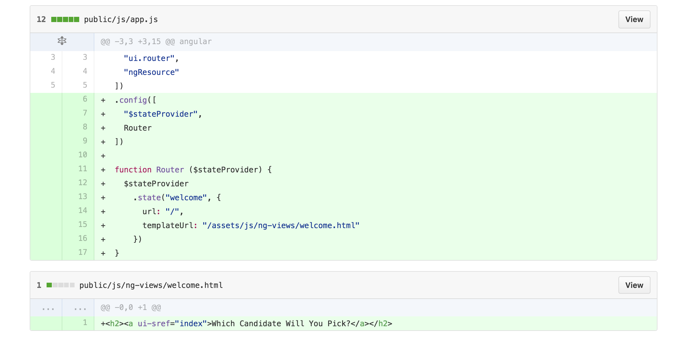

---

### [Adds Index Route](https://github.com/ga-wdi-exercises/whenpresident/commit/fa68cc105b67527c4986a721b51358dc16d82e2c)

**Steps**:
- Define a new state for "index"
- Modify an existing file to be the template rendered at that state
- Add a link to your "index" state in your welcome page

<!-- Index Route Commit Diff  -->
<details>
<summary>
**Hint**: If you are having a tough time getting started, take a peek at the commit diff
</summary>
<br>
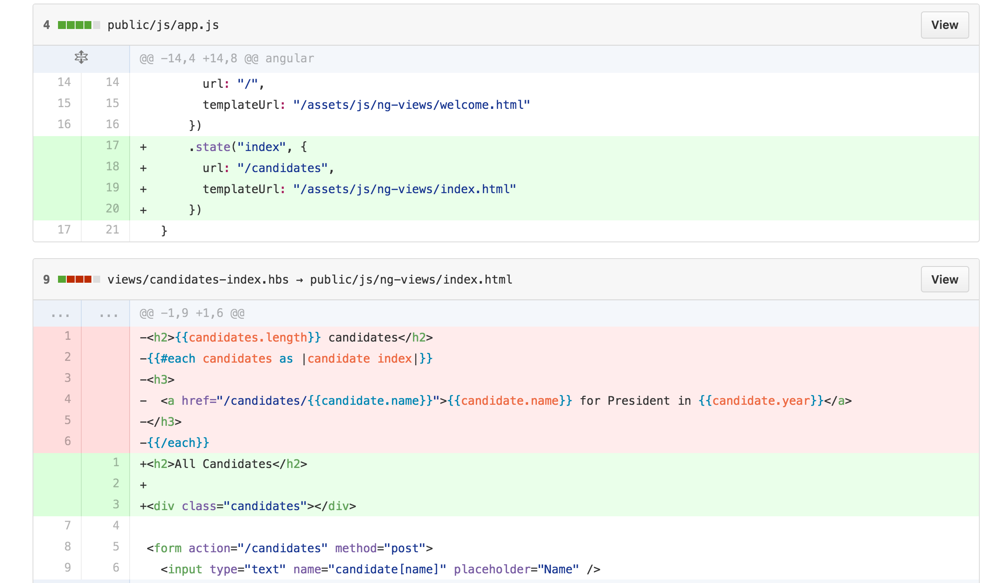
<br>
<br>
</details>

<br>
**Bonus**:
- Create and define a controller for your index state
- Try populating your view with some hard coded data, don't worry about connecting to our DB just yet

---

## Break (10 mins)

---

### [Makes API Routes for Candidates](https://github.com/ga-wdi-exercises/whenpresident/commit/a4207981999f0c9d3544aa5173b0c7ce7d6d4f7a)

Alright, let's review a little bit about what we want to accomplish when building out the Angular side of our application.  

So far, we still are using express to serve at least one server-side rendered view, that loads and initializes our Angular app. From there, Angular takes over the view templating and routing throughout our SPA. Also, eventually we want our front-end to be able to sync with our back-end in order to persist data throughout our app.

> How can we do this?

<!-- BE comparison to Rails  -->
<details>
<summary>
**Q**: How did we do this in Rails?
</summary>
<br>
```
By building out our own API, then making ajax requests from the front-end to our API endpoints in order to keep the data in sync.
```
<br>
<br>
</details>

<br>
We need to do exactly this kind of thing with our MEAN app: we need to setup our back-end to have routes that serve JSON.

**Questions**:

<!-- Q: api namespace  -->
<details>
<summary>
Why might it be a good idea to namespace our back-end routes under `api`?
</summary>
<br>
```
To avoid confusion between routes meant to serve html, and routes whose purpose it is to render our app's data as JSON
```
<br>
<br>
</details>

<!-- Q: Delete response  -->
<details>
<summary>
What is the significance of the response for our `delete` request?
</summary>
<br>
```
To provide a clue to the client that the request went through, and the delete was processed
```
<br>
<br>
</details>

<!-- Q: Update response  -->
<details>
<summary>
What is returned from our `put` request?
</summary>
<br>
```
A JSON object with our updated candidate's info!
```
<br>
<br>
</details>

<br>
In `index.js`: Candidates `Index` and `Show` Routes:
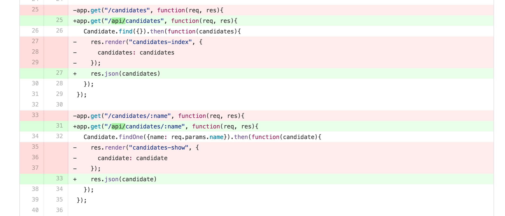

In `index.js`: Candidates `Delete` and `Update` Routes:
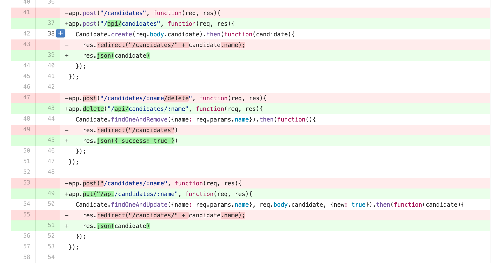

---

### [Adds Candidate Factory and Connect Index Controller to DB](https://github.com/ga-wdi-exercises/whenpresident/commit/c8f4b58a7bf4cf419e3272a737b812bb767649c7)

Great now that we have our back-end all setup to support requests from the front-end that will return JSON, let's add our Angular component that will allow us to fetch all that data.

<!-- Q: Angular Factory  -->
<details>
<summary>
**Q**. What Angular component do we need to setup in order to get data from our API?
</summary>
<br>
<center>
```
A factory for candidates
```
</center>

</details>

<br>
Go ahead and follow the outlined steps to add our app's Index functionality for candidates:

**Steps**:

- Create and define a new "Candidate" factory
- Pass your factory as an argument to the index controller and use it to fetch all candidates
- Replace any references to hard-coded data with data from your DB, and display relevant information about each Candidate in the view

<!-- Candidate Factory and Index Controller Commit Diff  -->
<details>
<summary>
**Hint**: If you are having a tough time getting started, take a peek at the commit diff
</summary>
<br>
<!-- Factory and Controller -->
`public/js/app.js`
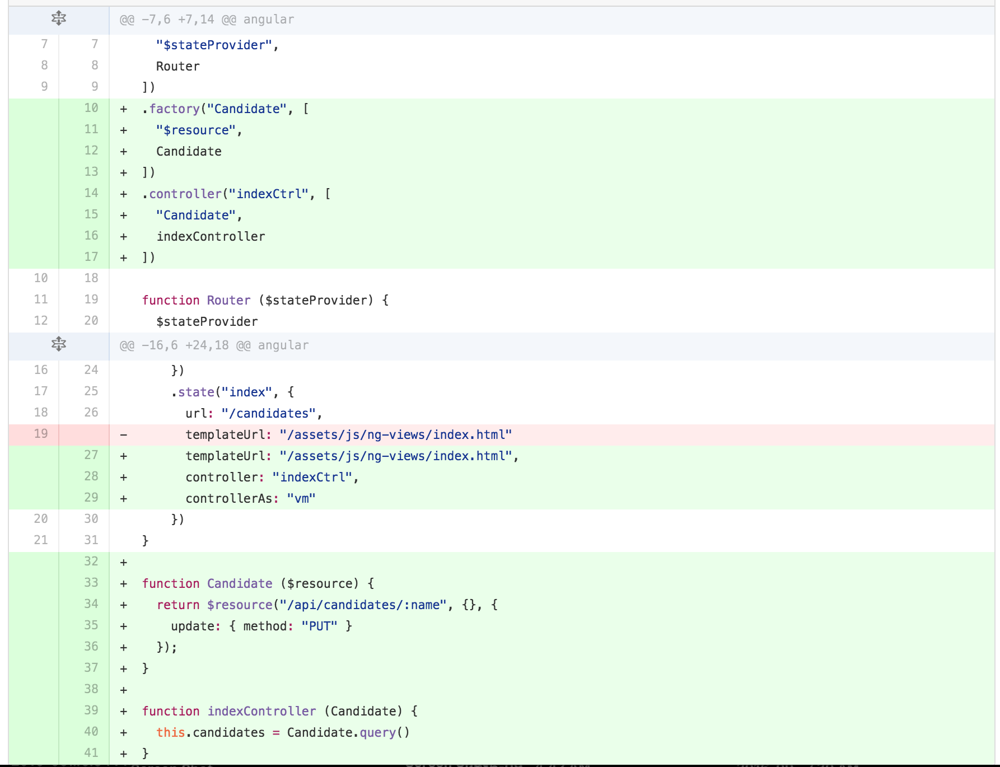
<!-- Candidates Index View -->
`public/js/ng-views/index.html`
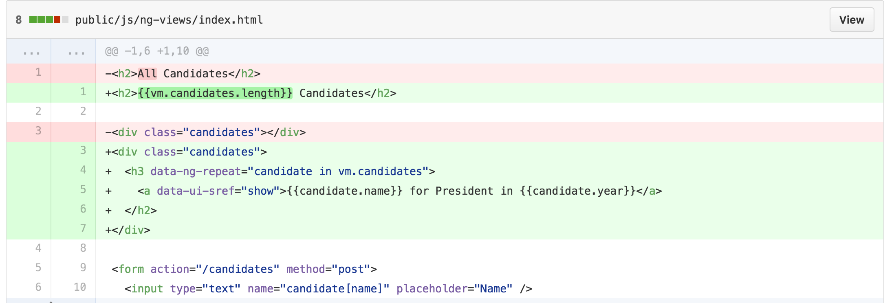
<br>
<br>
</details>

---

### [Adds Show Route](https://github.com/ga-wdi-exercises/whenpresident/commit/bd3ecd8d54398bd614c1fe1261e71d4eb1cbb57e)

Now that our app is behaving more like a SPA, let's add support for the Show Route by defining another state.

**Steps**:

- Create a new state definition for `show`
-  Delete `views/show.hbs` and create a template to be rendered when we are at our `show` state
- Define a new controller for `show`, make the appropriate query and display the correct data in the view

In `public/js/ng-views/show.html`: We need to add a `show` view to display information about a candidate
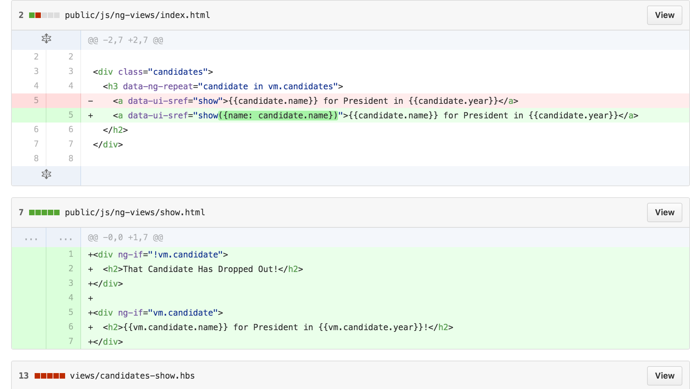


In `public/js/app.js`: We need to define a new state, controller, template, and support the query for show
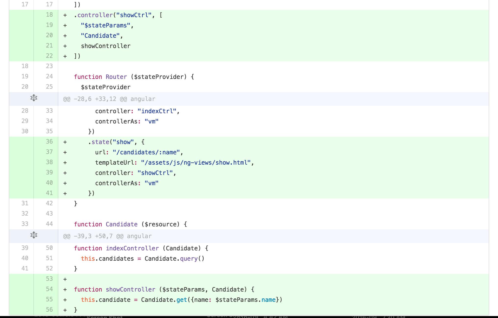

Finally, we can delete our `views/candidates-show.hbs` file since Angular will be handling our show view from here on out.

---

### [Adds Create Functionality](https://github.com/ga-wdi-exercises/whenpresident/commit/e787c60a8d349a09d94447e42deedf0fa64f4196)

Let's continue building out CRUD functionality, by adding the ability to create a new Candidate...

**Steps**:

- Update a the `index` view to include a form to create a new candidate
- Update the index controller to add a definition for our `create` method
  - It should persist the new candidate to the database
  - Take the user to the new candidate's show page after it is saved
- Update the create route in `index.js` to pass in `req.body` not `req.body.candidate`
- Change our app's body-parser configuration to use JSON

In `public/js/ng-views/index.html`: We need to add some UI
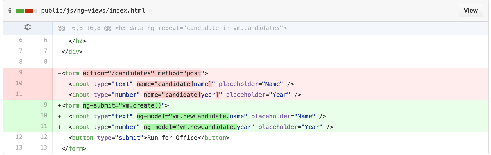


In `public/js/app.js`: We need to update the index controller to add a definition for our `create` method


Finally, we need to update the route in `index.js`:
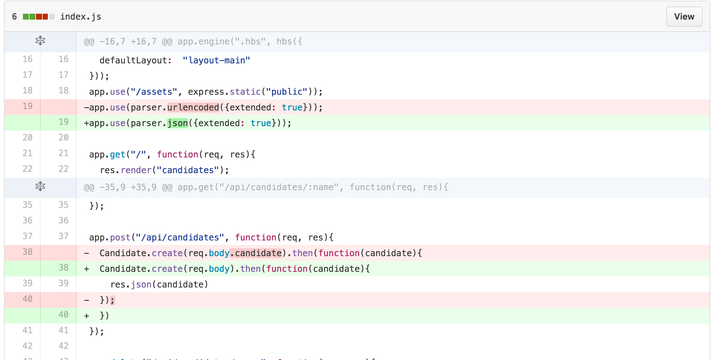

---

### [Adds Candidate Update](https://github.com/ga-wdi-exercises/whenpresident/commit/0b2b1546215e7e3cd6af2f6a14c30404f78845f2)

Moving onto the U in CRUD, let's build out our app's update functionality.

<!-- NHO: demo the importance of body parser via postman  -->

**Questions**:

<!-- Q: body-parser  -->
<details>
<summary>
 What role does `body-parser` play in our application?
</summary>
<br>
```
Body-Parser is necessary middleware that allows us to access the body of post requests from ajax requests and html form submissions. In our app, we use to parse the request's body as JSON.
 ```
 <br>
 <br>
</details>

<!-- Q: two-way data-binding  -->
<details>
<summary>
 What is two-way data-binding in Angular?
</summary>
<br>
```
Two-way data-binding in Angular apps is the automatic synchronization of data between the model and view components via viewmodels.
 ```
 <br>
 <br>
</details>

<br>

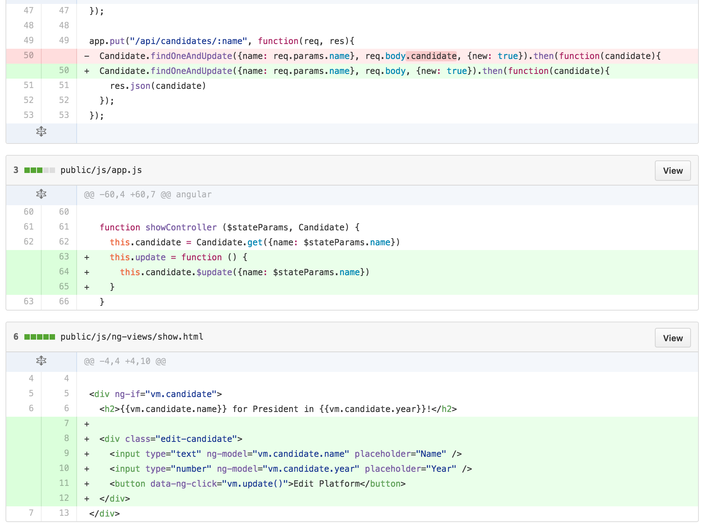

---

### [Adds Candidate Destroy](https://github.com/ga-wdi-exercises/whenpresident/commit/1f63608bb0d5f0712febf4b965c40c1568debff4)

As we put some of the finishing touches on our app, let's add the functionality so a candidate can "concede".

**Steps**:

- Modify the "concede" button in `show.html` to run an `update` method on click
- Define an `update` method in your `showCtrl` in `app.js`
- Pass in `$state` to your show controller than use it to redirect the user to the index root after deletion

<!-- Delete Commit Diff -->
<details>
<summary>
 **Hint**: If you're having trouble getting started, take a peek at the commit diff
</summary>
<br>

 <br>
 <br>
</details>

<br>

Great, now we have completed full CRUD for `candidates` in our MEAN app.

**If we have time**, we have a few more steps to build out the rest of our app's desired features:

---

## **(Bonus)** Clean Routes


### [Adds HTML5 Mode](https://github.com/ga-wdi-exercises/whenpresident/commit/8cf8fb0ce9ebdb1516940fc62d31cd3aae8dd433)

Next up, we need to configure our app to be a true HTML5 SPA. Part of this process involves cleaning up our url and getting rid of those pesky `#` signs.

**Questions**:

<!-- Q. Root Route  -->
<details>
<summary>
 What does changing the root route definition to `("/*")` do and why is it important for our app?
</summary>
<br>
```
We add the wildcard to our route, the `*`, so that all combinations of routes hit via the url manually will trigger our Angular SPA and allow us to use Angular's `html5Mode` to take over routing
```
<br>
<br>
</details>

<!-- Q. Base Href  -->
<details>
<summary>
 What is the purpose of adding `base href`?
</summary>
<br>
```
Adding the `base href` tag tells our app the base location from which links on a page should be made
```
<br>
<br>
</details>

<br>  
In `index.js`: change our app's root route
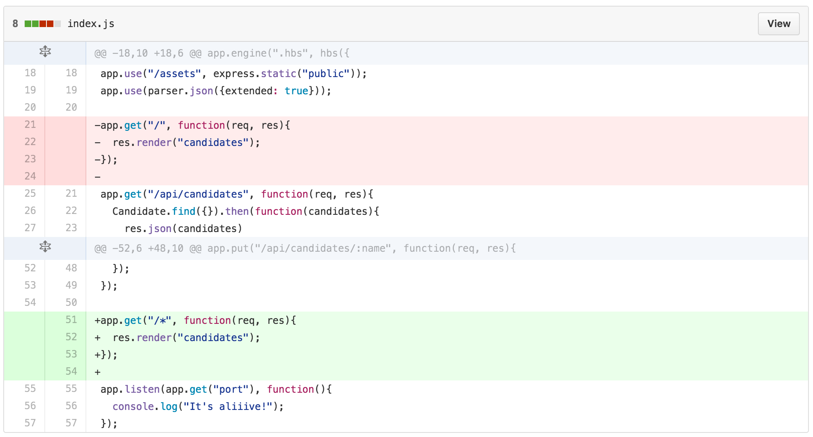

In `public/js/app.js`: turn on HTML5 mode


In `views/layout-main.hbs`: add our app's base ref

> For further reading: checkout [this link](https://github.com/ga-wdi-lessons/angular-routing#locationprovider) to the `$locationProvider` section in the `uiRouter` class

---

### [Adds Redirect to Root Route](https://github.com/ga-wdi-exercises/whenpresident/commit/f1d4585aa70a0ee76ec7b4f960123f3aac0fd476)

Continuing with the work with our app's routes, we need a way to redirect any request not defined in our app's states to a default state

**Questions**:

<!-- Q. $urlRouterProvider.otherwise -->
<details>
<summary>
 What is the importance of the argument to `$urlRouterProvider.otherwise`?
</summary>
<br>
```
The url to redirect to if any request does not match our app's defined states
```
<br>
<br>
</details>

<!-- Q. $urlRouterProvider.otherwise -->
<details>
<summary>
  If you had to guess, when is `$urlRouterProvider` activated?
</summary>
<br>
```
$urlRouterProvider is activated any time a state transition is made
```
<br>
<br>
</details>

<br>

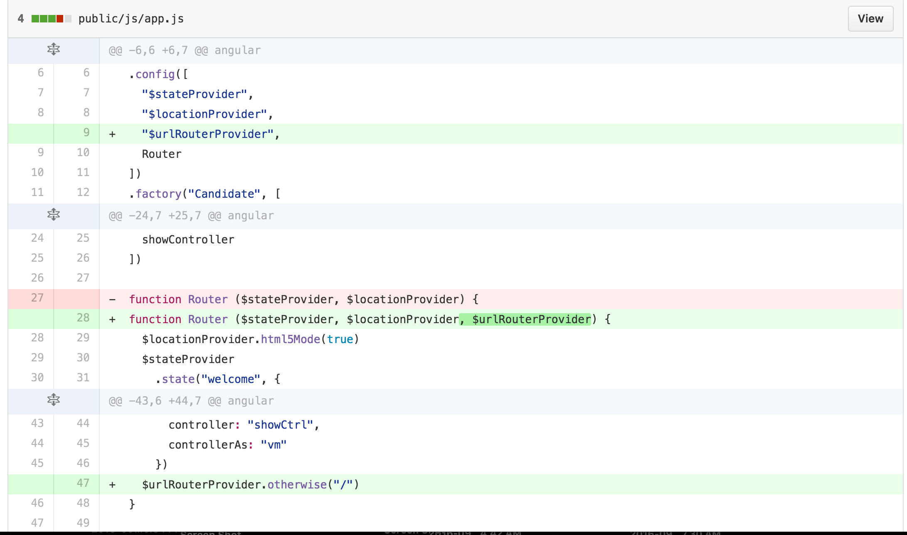

---
> [Back to Main](readme.md)
