# Putting the A in MEAN

> [Back to Main](readme.md)

## Adding Angular to Presidents

In this exercise, our goal is to refactor a full stack express app with server side rendered views, into a Single Page App by adding Angular and using our back-end to render `JSON`.

---

### Setup

We are going to start from a specific point in `WhenPresident`'s history, so go ahead and run the below commands to checkout to the starter code for this exercise:

If you want to start fresh, clone down the repo:
```bash
$ git clone git@github.com:ga-wdi-exercises/whenpresident.git
$ cd whenpresident
```
After you clone, or after you're working from your local copy:

```bash
# get the latest changes from github
$ git fetch --all
$ git checkout angular-starter
$ git checkout -b myname-angular
```
> Note: you can also add your fork as a remote or if you're working from your local copy, set ga-wdi-exercises repo as upstream, in order to fetch changes

Great, now that we have our MEN app locally, let's take a few minutes to look around at our app's state and get familiar with the files and directories.

<details>
<summary>
**Q**. If we just cloned down an express app, what else do we need to run to complete our setup?
</summary>
<br>
```
We need to install our dependencies, and configure our database locally
 ```
</details>

---

To install our app's dependencies, run:

```bash
$ npm install
```

In another tab, let's run our mongo server
```bash
$ mongod
```

Then create our database and seed it locally:

```bash
$ mongo
> use whenpresident
# In another tab
$ node db/seed.js
```

> **Note**: be sure to create and connect to your database if you haven't already

We need to do one more setup step, which is to include an `env.json` file for our login with twitter OAuth to work.

Go ahead and run the following command if you do not already have a `env.json`:

```bash
$ mv sample.env.json env.json
```

Now lets start our server and make sure everything works

```bash
$ nodemon
```

If there are no errors in the terminal, we can now navigate in our browser to: http://localhost:3001 to interact with our app.

---

#### STOP

---

<!-- NHO: TODO: evaluate the turn in talk or dive into walkthrough of starter  -->
### Turn and Talk (5 mins)
<br>
Without writing any code, take 2 minutes to [look through](https://github.com/ga-wdi-exercises/whenpresident/tree/c1537cff04d43de448dc4280711a9e5d92c6de7e) the code and try to determine:

- What parts of app will stay the same
- What parts will need to be removed/modified
- What are some of the files we are going to need for our app

---

## **< data-ng-presidents />**

---

Let's take a look at the last commit, ["Added Angular Dependencies"](https://github.com/ga-wdi-exercises/whenpresident/commit/c1537cff04d43de448dc4280711a9e5d92c6de7e) to get a sense of our starting point.

We already have a starter file for Angular, `public/js/app.js`, with our initial module defined:

```js
"use strict";

(function(){

  angular
  .module("candidates", [
    "ui.router",
    "ngResource"
  ]);

})();
```

As well as are currently loading in Angular and its sub packages in `views/candidates.hbs`

```html
<script src="https://cdnjs.cloudflare.com/ajax/libs/angular.js/1.5.3/angular.min.js"></script>
<script src="https://cdnjs.cloudflare.com/ajax/libs/angular.js/1.5.3/angular-resource.min.js"></script>
<script src="https://cdnjs.cloudflare.com/ajax/libs/angular-ui-router/0.2.18/angular-ui-router.min.js"></script>
<script src="/assets/js/app.js"></script>

<div data-ng-app="candidates">
  <main data-ui-view></main>
</div>
```

> **Note**: If you want to work with this app offline, you can use `bower` to load front end asset libraries. See [this commit](https://github.com/ga-wdi-exercises/whenpresident/commit/656343c9db904aca407d9e7aa5caf7945277ea53) for more app configuration.

> Make sure to install `bower` through `npm` and then use `bower` like `npm` to load packages. **Pro-tip**: remember to use `bower install --save` when installing packages and to add `bower_components` to `.gitignore`

**Review Questions**:

<!-- Q: ng-app  -->
<details>
<summary>
 What is `data-ng-app` and what is it doing?</summary>
<br>
```
data-ng-app is a directive that initializes our angular-app
 ```
<br>
<br>
</details>

<!-- Q: ui-view  -->
<details>
<summary>
 What role does `data-ui-view` play in our application?
</summary>
<br>
```
data-ui-view is the placeholder for where all of our angular rendered html templates will go
 ```
 <br>
 <br>
</details>

<!-- Q: root route  -->
<details>
<summary>
 Which route is currently loading our Angular app?
</summary>
<br>
```
Our root route, "/"
 ```
<br>
<br>
</details>

---

### [Adds Welcome Page](https://github.com/ga-wdi-exercises/whenpresident/commit/d56558786fecd844747fcba1f19f501f71ce73d5)

In our first step, we need to configure our app's router, and define a state for our app's `welcome-page`

**Questions:**
<!-- Q: What other component do we need to define   -->
<details>
<summary>
 If we want to configure our app's router, what additional Angular component do we need to define?
</summary>
<br>
```
.config
```
<br>
<br>
</details>

<!-- Q: What dependencies are necessary for our config function   -->
<details>
<summary>
 What dependencies are necessary for our `config` function?
</summary>
<br>
```
$stateProvider and a Router function
```
<br>
<br>
</details>

<!-- Q: What is the importance of the first argument for .state? -->
<details>
<summary>
 What is the importance of the first argument for `.state`?
</summary>
<br>
```
The first argument is the name for our state, in this case "welcome"
```
<br>
<br>
</details>

<!-- Q: View template  -->
<details>
<summary>
 What existing file can we modify to serve as our welcome template?
</summary>
<br>
```
views/app-welcome.hbs --> public/html/candidates-welcome.html
```
<br>
<br>
</details>

<!-- Q: Public Assets  -->
<details>
<summary>
 What line in our server's configuration specifies where to look for our app's static assets?
</summary>
<br>
```
app.use("/assets", express.static("public"));

```
<br>
<br>
</details>

<br>
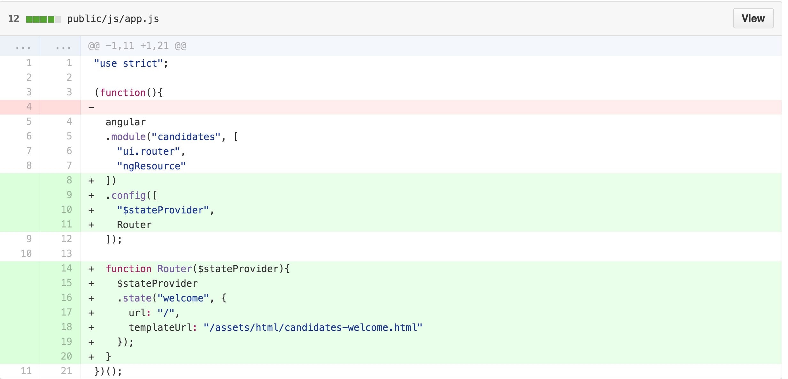

---

### (You-Do) [Adds Index Route](https://github.com/ga-wdi-exercises/whenpresident/commit/bfc9247278d8007cf8f1704dc93a3517eaa6d8f0)

**Steps**:
- Define a new state for "index"
- Modify an existing file to be the template rendered at that state
- Add a link to your "index" state in your welcome page

<!-- Index Route Commit Diff  -->
<details>
<summary>
**Hint**: If you are having a tough time getting started, take a peek at the commit diff
</summary>
<br>
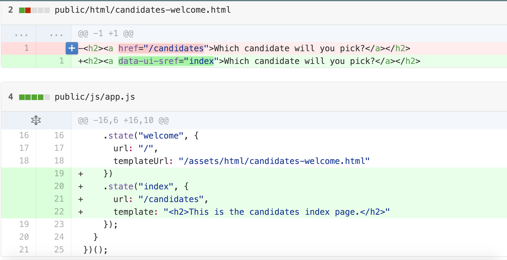
<br>
<br>
</details>

<br>
**Bonus**:
- Create and define a controller for your index state
- Try populating your view with some hard coded data, don't worry about connecting to our DB just yet

---

## Break (10 mins)

---

### [Makes API Routes for Candidates](https://github.com/ga-wdi-exercises/whenpresident/commit/677b59be5287a70354fd4872e13fd069ed973fe8)

Alright, let's review a little bit about what we want to accomplish when building out the Angular side of our application.  

So far, we still are using express to serve at least one server-side rendered view, that loads and initializes our Angular app. From there, Angular takes over the view templating and routing throughout our SPA. Also, eventually we want our front-end to be able to sync with our back-end in order to persist data throughout our app.

> How can we do this?

<!-- BE comparison to Rails  -->
<details>
<summary>
**Q**: How did we do this in Rails?
</summary>
<br>
```
By building out our own API, then making ajax requests from the front-end to our API endpoints in order to keep the data in sync.
```
<br>
<br>
</details>

<br>
We need to do exactly this kind of thing with our MEAN app: we need to setup our back-end to have routes that serve JSON.

**Questions**:

<!-- Q: api namespace  -->
<details>
<summary>
Why might it be a good idea to namespace our back-end routes under `api`?
</summary>
<br>
```
To avoid confusion between routes meant to serve html, and routes whose purpose it is to render our app's data as JSON
```
<br>
<br>
</details>

<!-- Q: Delete response  -->
<details>
<summary>
What is the significance of the response for our `delete` request?
</summary>
<br>
```
To provide a clue to the client that the request went through, and the delete was processed
```
<br>
<br>
</details>

<!-- Q: Update response  -->
<details>
<summary>
What is returned from our `put` request?
</summary>
<br>
```
A JSON object with our updated candidate's info!
```
<br>
<br>
</details>

<br>
In `index.js`: Candidates `Index` and `Show` Routes:


> **Note**: no need to worry about the route for "/logout" (lines 64-69 above)

In `index.js`: Candidates `Delete` and `Update` Routes:
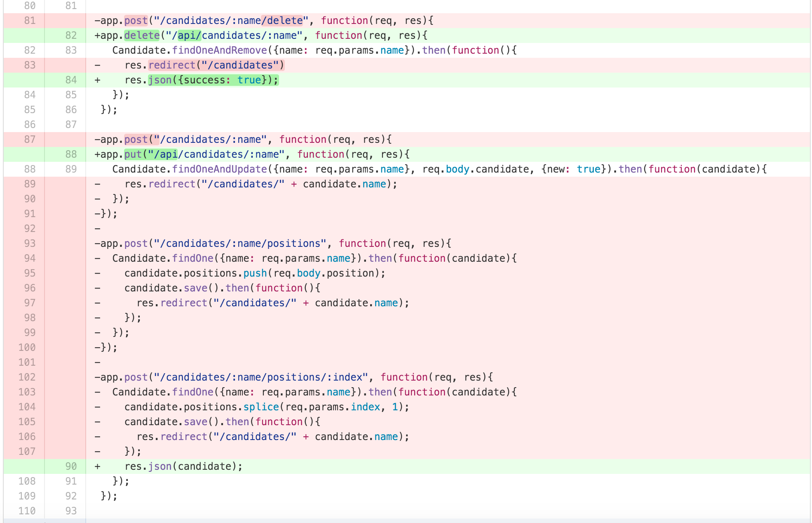

---

### (You-Do) [Adds Candidate Factory and Connect Index Controller to DB](https://github.com/ga-wdi-exercises/whenpresident/commit/9f36a80f55e8fe613d39bbda85849e975f32d5a9)

Great now that we have our back-end all setup to support requests from the front-end that will return JSON, let's add our Angular component that will allow us to fetch all that data.

<!-- Q: Angular Factory  -->
<details>
<summary>
**Q**. What Angular component do we need to setup in order to get data from our API?
</summary>
<br>
<center>
```
A factory for candidates
```
</center>

</details>

<br>
Go ahead and follow the outlined steps to add our app's Index functionality for candidates:

**Steps**:

- Create and define a new "Candidate" factory
- Pass your factory as an argument to the index controller and use it to fetch all candidates
- Replace any references to hard-coded data with data from your DB, and display relevant information about each Candidate in the view

<!-- Candidate Factory and Index Controller Commit Diff  -->
<details>
<summary>
**Hint**: If you are having a tough time getting started, take a peek at the commit diff
</summary>
<br>
<!-- Factory and Controller -->
`public/js/app.js`
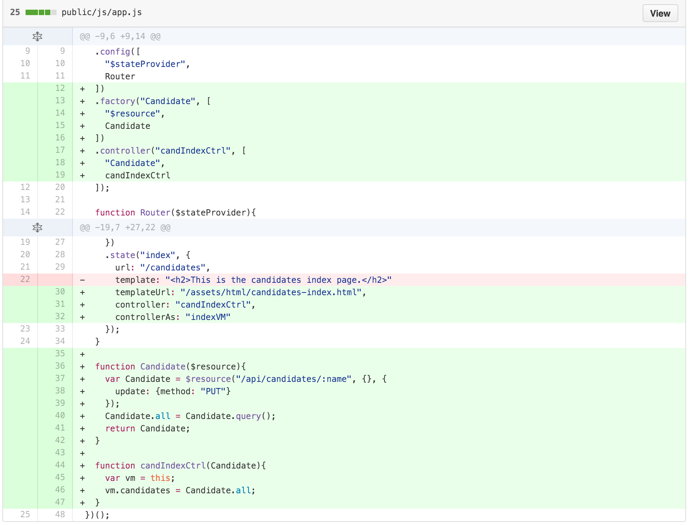
<!-- Candidates Index View -->
`public/html/candidates-index.html`
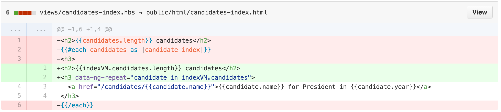
<br>
<br>
</details>

---

### [Adds HTML5 Mode](https://github.com/ga-wdi-exercises/whenpresident/commit/915bcc840a4b8e8956ade78c6833f130cb460c78)

Next up, we need to configure our app to be a true HTML5 SPA. Part of this process involves cleaning up our url and getting rid of those pesky `#` signs.

**Questions**:

<!-- Q. Root Route  -->
<details>
<summary>
 What does changing the root route definition to `("/*")` do and why is it important for our app?
</summary>
<br>
```
We add the wildcard to our route, the `*`, so that all combinations of routes hit via the url manually will trigger our Angular SPA and allow us to use Angular's `html5Mode` to take over routing
```
<br>
<br>
</details>

<!-- Q. Base Href  -->
<details>
<summary>
 What is the purpose of adding `base href`?
</summary>
<br>
```
Adding the `base href` tag tells our app the base location from which links on a page should be made
```
<br>
<br>
</details>

<br>  
In `index.js`: change our app's root route
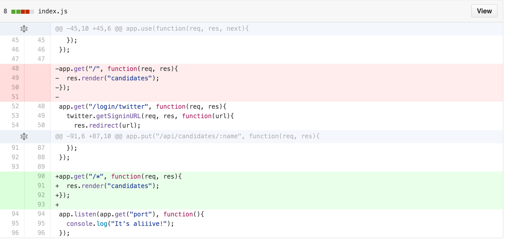

In `public/js/app.js`: turn on HTML5 mode
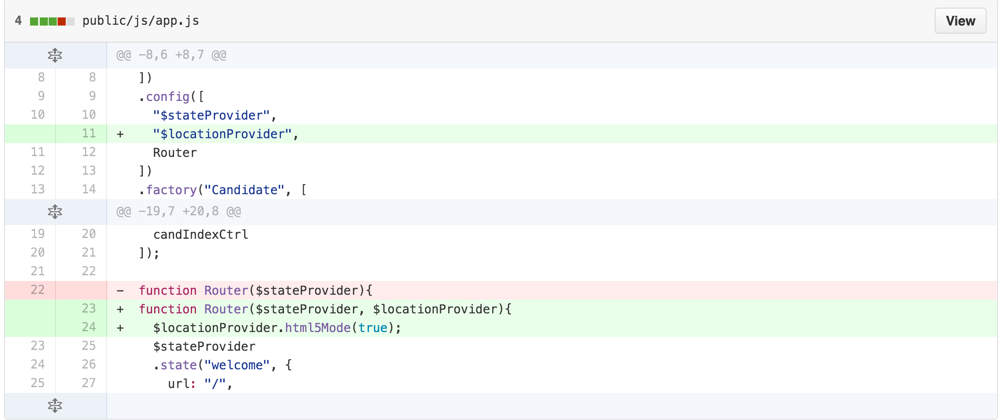

In `views/layout-main.hbs`: add our app's base ref
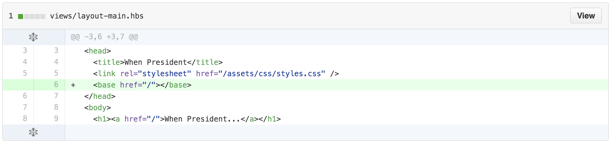

> For further reading: checkout [this link](https://github.com/ga-wdi-lessons/angular-routing#locationprovider) to the `$locationProvider` section in the `uiRouter` class

---

### [Adds Redirect to Root Route](https://github.com/ga-wdi-exercises/whenpresident/commit/a8111764bbb0641bd2f26b33932f85256a731c63)

Continuing with the work with our app's routes, we need a way to redirect any request not defined in our app's states to a default state

**Questions**:

<!-- Q. $urlRouterProvider.otherwise -->
<details>
<summary>
 What is the importance of the argument to `$urlRouterProvider.otherwise`?
</summary>
<br>
```
The url to redirect to if any request does not match our app's defined states
```
<br>
<br>
</details>

<!-- Q. $urlRouterProvider.otherwise -->
<details>
<summary>
  If you had to guess, when is `$urlRouterProvider` activated?
</summary>
<br>
```
$urlRouterProvider is activated any time a state transition is made
```
<br>
<br>
</details>

<br>

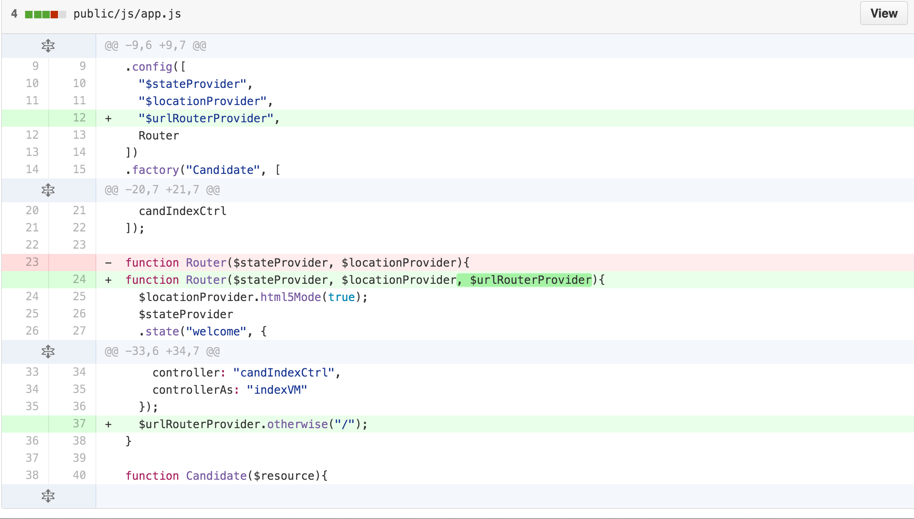

---

### (You-Do) [Adds Show Route](https://github.com/ga-wdi-exercises/whenpresident/commit/48cf115b7847c8d1601aeff2a23cc5cd0ad7fb5a)

Now that our app is behaving more like a SPA, let's add support for the Show Route by defining another state.

**Steps**:

- Create a new state definition for `show`
-  Delete `views/candidates-show.hbs` and create a template to be rendered when we are at our `show` state
- Define a new controller for `show`, make the appropriate query and display the correct data in the view

**Bonus**:

- In your server-side root route definition, query through all the documents for candidates to define a `isCurrentUser` property that should only be true for the signed in user
- Use the `isCurrentUser` field to hide / show appropriate content if the current user is the candidate
  - Create the UI component to add a position to a candidate

In `index.js`: We set the value for `isCurrentUser` for all candidates
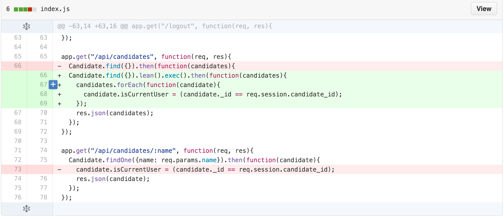
> **Note**: `.lean()` is a method that takes a mongoose object and returns a json object. `.exec()` is necessary to run whenever you use `.lean`

In `public/html/candidates-show.html`: We need to add a `show` view to display information about a candidate
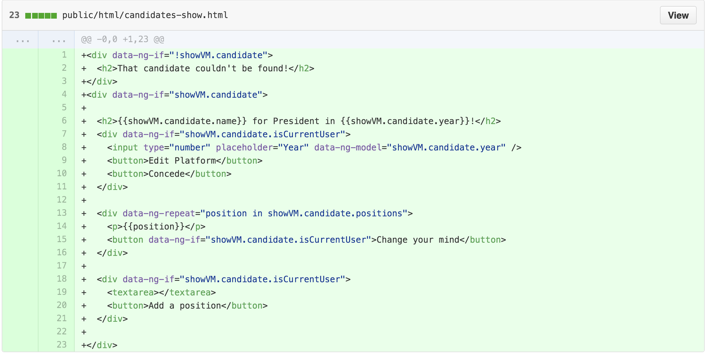

> **Note**: Don't worry about the logic in the view with`isCurrentUser`, or supporting the ability to add positions just yet

In `public/js/app.js`: We need to define a new state, controller, template, and support the query for show
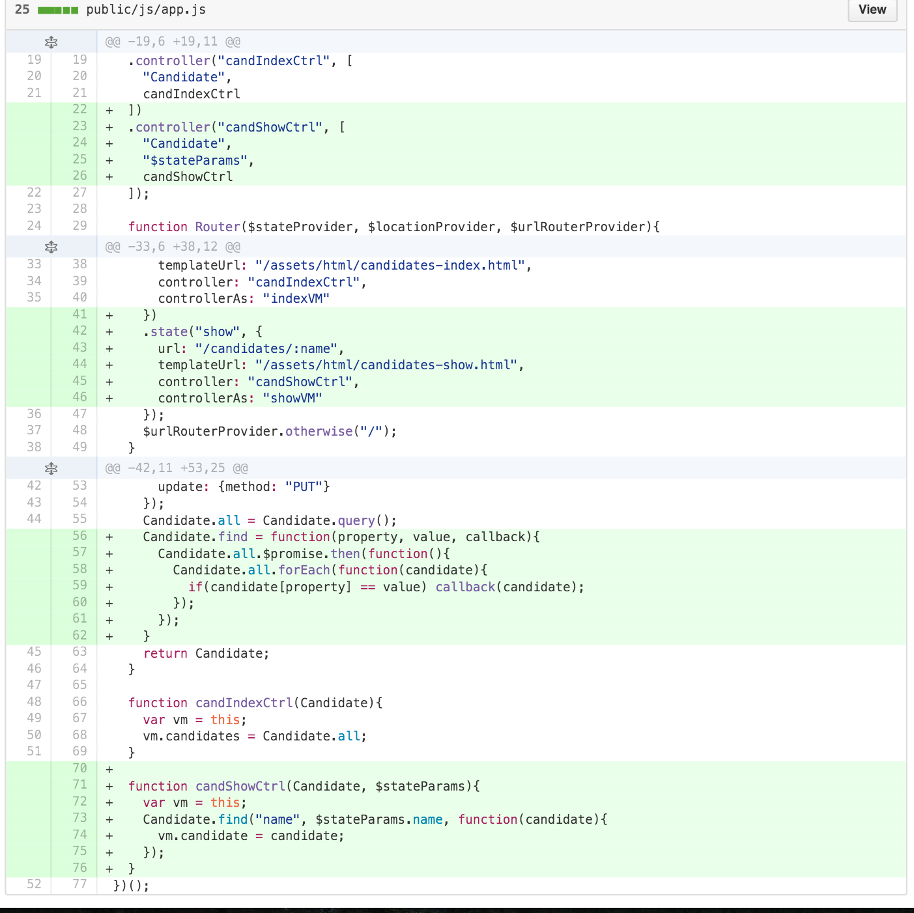

Finally, we can delete our `views/candidates-show.hbs` file since Angular will be handling our show view from here on out.
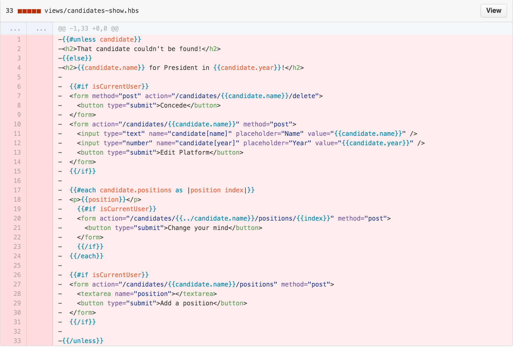

---

### [Adds Candidate Update](https://github.com/ga-wdi-exercises/whenpresident/commit/c9961f23086850fcd45beb85cd375f7c714d8f35)

Moving onto the U in CRUD, let's build out our app's update functionality.

<!-- NHO: demo the importance of body parser via postman  -->

**Questions**:

<!-- Q: body-parser  -->
<details>
<summary>
 What role does `body-parser` play in our application?
</summary>
<br>
```
Body-Parser is necessary middleware that allows us to access the body of post requests from ajax requests and html form submissions. In our app, we use to parse the request's body as JSON.
 ```
 <br>
 <br>
</details>

<!-- Q: two-way data-binding  -->
<details>
<summary>
 What is two-way data-binding in Angular?
</summary>
<br>
```
Two-way data-binding in Angular apps is the automatic synchronization of data between the model and view components via viewmodels.
 ```
 <br>
 <br>
</details>

<!-- Q: alternate syntax for Update -->
<details>
<summary>
 What is an alternate syntax to make an `update` call in Angular ?
</summary>
<br>
We can call an instance method as well:
```
  vm.update = function (){
    vm.candidate.$update().then(function(candidate){
        vm.candiidate = candidate
      })
  }
 ```
 <br>
 <br>
</details>

<br>

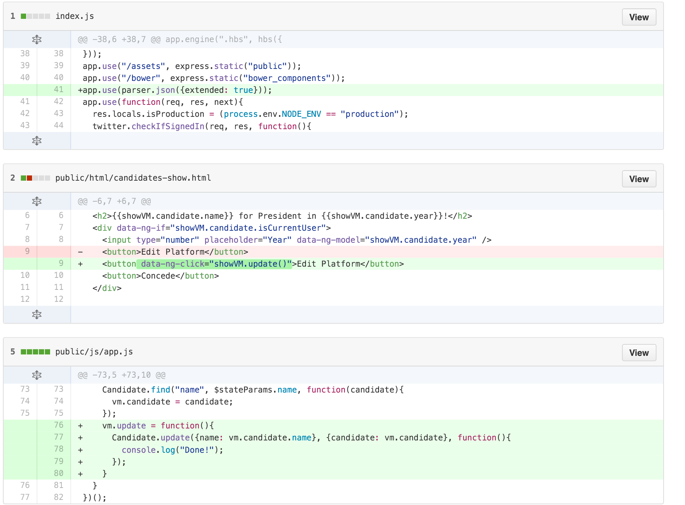

<!-- Demo body parser via update with Postman  -->
---

### (You-Do) [Adds Candidate Delete](https://github.com/ga-wdi-exercises/whenpresident/commit/331e2649984ef7879796fb766b9322c0a700e8e9)

As we put some of the finishing touches on our app, let's add the functionality to a candidate can "concede".

**Steps**:

- Modify the "concede" button in `candiates-show.html` to run an `update` method on click
- Define an `update` method in your `candShowCtrl` in `app.js`
- Add `$window` as a dependency to your `candShowCtrl` and make sure to pass it into your function
- Replace `$window.location` with the root route to trigger a page reload

<!-- Delete Commit Diff -->
<details>
<summary>
 **Hint**: If you're having trouble getting started, take a peek at the commit diff
</summary>
<br>
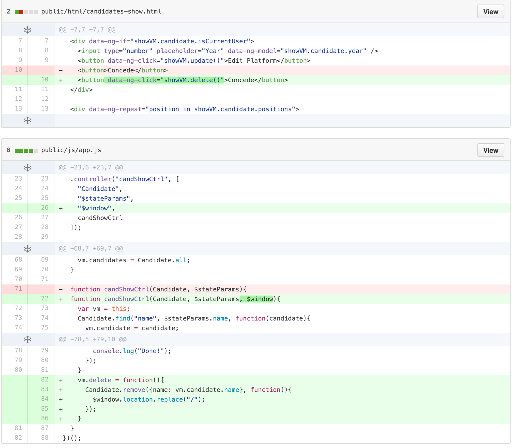
 <br>
 <br>
</details>

<br>

Great, now we have completed full CRUD for `candidates` in our MEAN app.

**If we have time**, we have a few more steps to build out the rest of our app's desired features:

---

## **(Bonus)** CRD for Positions
<br>
**[Can Add a New Position](https://github.com/ga-wdi-exercises/whenpresident/commit/d3374a15b00e4a71ad7104c2b2f12178a01895d0)**

**[Can Delete Positions](https://github.com/ga-wdi-exercises/whenpresident/commit/c989c50eab587766456eae349acf3e71a6e6ed49)**

---

## **(Double Bonus)** Add User Endorsements
<br>
**[Adds Endorsement Schema](https://github.com/ga-wdi-exercises/whenpresident/commit/607b73e592d7b7523cd966950bc4def4d752a009)**

**[Adds Endorsements](https://github.com/ga-wdi-exercises/whenpresident/commit/69044912daca740e4379b818813ff84fc0807dee)**

**[Can Endorse a Candidate Only Once](https://github.com/ga-wdi-exercises/whenpresident/commit/6885aed6efa59aefe1820003d9be8ea34898c10d)**

---
> [Back to Main](readme.md)
