# https://www.github.com/ga-wdi-exercises/whenpresident 
> This commit history created using [Diffshot](https://github.com/RobertAKARobin/diffshot)


## Table of Contents
- [b734a8f: Added Angular dependencies](#added-angular-dependencies)
  - [index.js](#added-angular-dependencies-indexjs)
  - [public/js/app.js](#added-angular-dependencies-publicjsappjs)
  - [views/layout-main.hbs](#added-angular-dependencies-viewslayout-mainhbs)
- [ab1cccb: Added router and some test states](#added-router-and-some-test-states)
  - [public/js/app.js](#added-router-and-some-test-states-publicjsappjs)
  - [views/layout-main.hbs](#added-router-and-some-test-states-viewslayout-mainhbs)
- [2bdfdc2: Added rudimentary index route](#added-rudimentary-index-route)
  - [public/html/candidates-index.html](#added-rudimentary-index-route-publichtmlcandidates-indexhtml)
  - [public/js/app.js](#added-rudimentary-index-route-publicjsappjs)
- [5856756: Displays fake candidate data on index](#displays-fake-candidate-data-on-index)
  - [public/html/candidates-index.html](#displays-fake-candidate-data-on-index-publichtmlcandidates-indexhtml)
  - [public/js/app.js](#displays-fake-candidate-data-on-index-publicjsappjs)
- [9c37807: Displays actual candidate data from database](#displays-actual-candidate-data-from-database)
  - [index.js](#displays-actual-candidate-data-from-database-indexjs)
  - [public/js/app.js](#displays-actual-candidate-data-from-database-publicjsappjs)
- [c73089c: Show route seems to query api successfully](#show-route-seems-to-query-api-successfully)
  - [index.js](#show-route-seems-to-query-api-successfully-indexjs)
  - [public/html/candidates-show.html](#show-route-seems-to-query-api-successfully-publichtmlcandidates-showhtml)
  - [public/js/app.js](#show-route-seems-to-query-api-successfully-publicjsappjs)
- [32f0878: Made Show page display correct data without errors](#made-show-page-display-correct-data-without-errors)
  - [public/html/candidates-show.html](#made-show-page-display-correct-data-without-errors-publichtmlcandidates-showhtml)
- [24562d8: Added HTML5 mode](#added-html5-mode)
  - [index.js](#added-html5-mode-indexjs)
  - [public/js/app.js](#added-html5-mode-publicjsappjs)
  - [views/layout-main.hbs](#added-html5-mode-viewslayout-mainhbs)
- [0d6d1b4: Added candidate create functionality](#added-candidate-create-functionality)
  - [index.js](#added-candidate-create-functionality-indexjs)
  - [public/html/candidates-index.html](#added-candidate-create-functionality-publichtmlcandidates-indexhtml)
  - [public/js/app.js](#added-candidate-create-functionality-publicjsappjs)
- [907cbaf: Added candidate update functionality](#added-candidate-update-functionality)
  - [index.js](#added-candidate-update-functionality-indexjs)
  - [public/html/candidates-show.html](#added-candidate-update-functionality-publichtmlcandidates-showhtml)
  - [public/js/app.js](#added-candidate-update-functionality-publicjsappjs)
- [b69572d: Can delete candidate from database](#can-delete-candidate-from-database)
  - [index.js](#can-delete-candidate-from-database-indexjs)
  - [public/html/candidates-show.html](#can-delete-candidate-from-database-publichtmlcandidates-showhtml)
  - [public/js/app.js](#can-delete-candidate-from-database-publicjsappjs)

# Setup

```
$ git clone git@github.com:ga-wdi-exercises/whenpresident.git whenprez-angular
$ cd whenprez-angular
$ git checkout 02181c9
$ git checkout -b angular-starter
```

- You just downloaded a Node app. What's the next command you should run?

### Turn and Talk (5 mins)
We're turning this MEN app into a MEAN app. We'll be using ngResource to get data from the database. Please answer:

- What parts of app will stay the same
- What parts will need to be removed/modified
- What are some of the files we are going to need for our app

# Added Angular dependencies

> [b734a8f](https://www.github.com/ga-wdi-exercises/whenpresident/commit/b734a8f)

```
<script src="https://cdnjs.cloudflare.com/ajax/libs/angular.js/1.5.3/angular.min.js"></script>
<script src="https://cdnjs.cloudflare.com/ajax/libs/angular.js/1.5.3/angular-resource.min.js"></script>
<script src="https://cdnjs.cloudflare.com/ajax/libs/angular-ui-router/0.2.18/angular-ui-router.min.js"></script>
```

### [Added Angular dependencies: `index.js`](https://www.github.com/ga-wdi-exercises/whenpresident/blob/b734a8f/index.js)
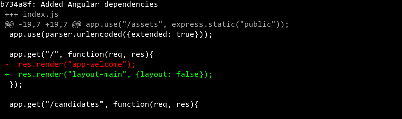

### [Added Angular dependencies: `public/js/app.js`](https://www.github.com/ga-wdi-exercises/whenpresident/blob/b734a8f/public/js/app.js)
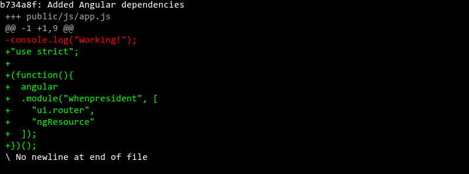

### [Added Angular dependencies: `views/layout-main.hbs`](https://www.github.com/ga-wdi-exercises/whenpresident/blob/b734a8f/views/layout-main.hbs)
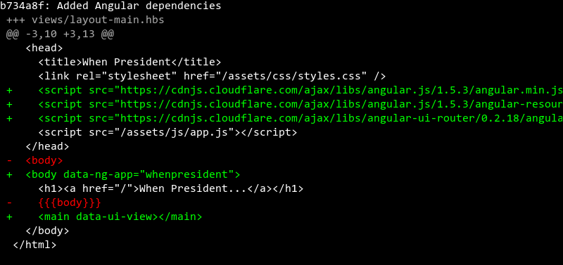

# Added router and some test states

> [ab1cccb](https://www.github.com/ga-wdi-exercises/whenpresident/commit/ab1cccb)

**Questions:**
<!-- Q: What other component do we need to define   -->
<details>
<summary>
 If we want to configure our app's router, what additional Angular component do we need to define?
</summary>
<br>
```
.config
```
<br>
<br>
</details>

<!-- Q: What dependencies are necessary for our config function   -->
<details>
<summary>
 What dependencies are necessary for our `config` function?
</summary>
<br>
```
$stateProvider and a Router function
```
<br>
<br>
</details>

<!-- Q: What is the importance of the first argument for .state? -->
<details>
<summary>
 What is the importance of the first argument for `.state`?
</summary>
<br>
```
The first argument is the name for our state, in this case "welcome"
```
<br>
<br>
</details>

<!-- Q: View template  -->
<details>
<summary>
 What existing file can we modify to serve as our welcome template?
</summary>
<br>
```
views/app-welcome.hbs --> public/html/candidates-welcome.html
```
<br>
<br>
</details>

<!-- Q: Public Assets  -->
<details>
<summary>
 What line in our server's configuration specifies where to look for our app's static assets?
</summary>
<br>
```
app.use("/assets", express.static("public"));

```
<br>
<br>
</details>

### [Added router and some test states: `public/js/app.js`](https://www.github.com/ga-wdi-exercises/whenpresident/blob/ab1cccb/public/js/app.js)
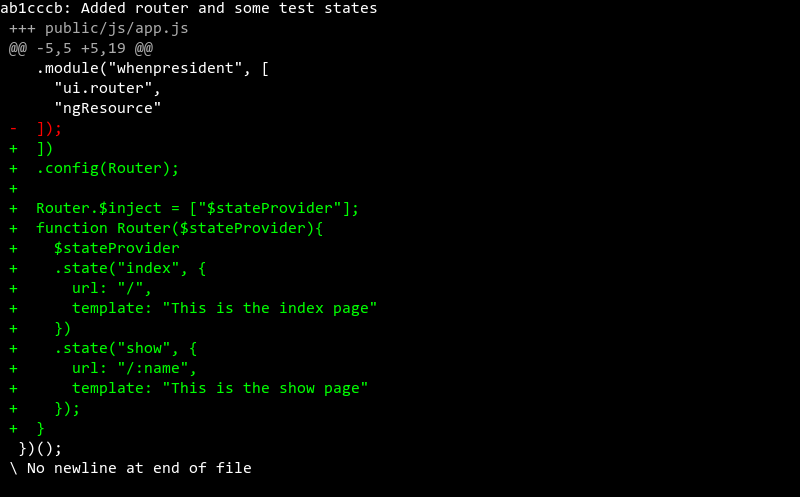

### [Added router and some test states: `views/layout-main.hbs`](https://www.github.com/ga-wdi-exercises/whenpresident/blob/ab1cccb/views/layout-main.hbs)
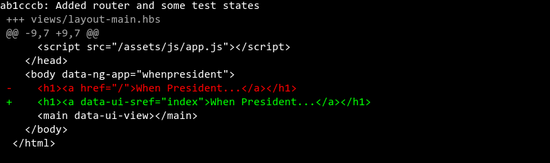

# Added rudimentary index route

> [2bdfdc2](https://www.github.com/ga-wdi-exercises/whenpresident/commit/2bdfdc2)

### [Added rudimentary index route: `public/html/candidates-index.html`](https://www.github.com/ga-wdi-exercises/whenpresident/blob/2bdfdc2/public/html/candidates-index.html)
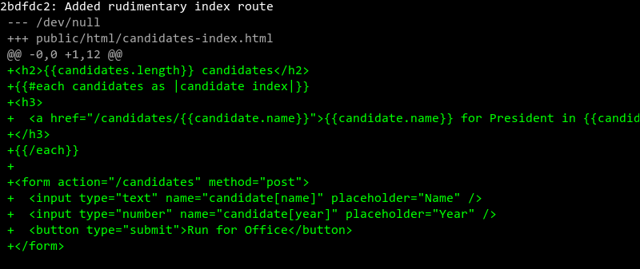

### [Added rudimentary index route: `public/js/app.js`](https://www.github.com/ga-wdi-exercises/whenpresident/blob/2bdfdc2/public/js/app.js)
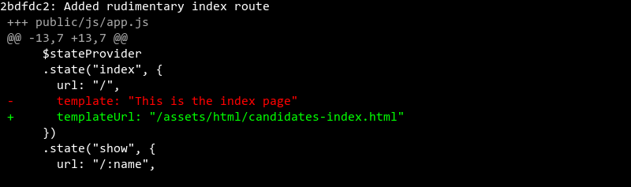

# Displays fake candidate data on index

> [5856756](https://www.github.com/ga-wdi-exercises/whenpresident/commit/5856756)

### [Displays fake candidate data on index: `public/html/candidates-index.html`](https://www.github.com/ga-wdi-exercises/whenpresident/blob/5856756/public/html/candidates-index.html)
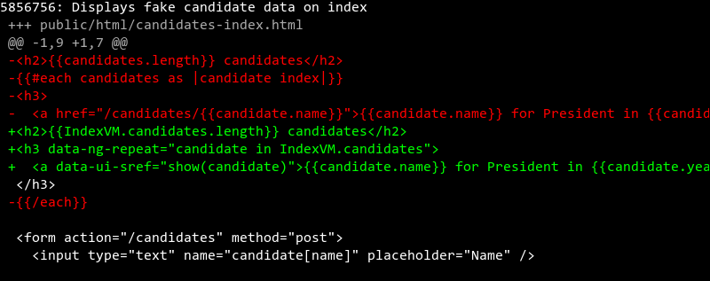

### [Displays fake candidate data on index: `public/js/app.js`](https://www.github.com/ga-wdi-exercises/whenpresident/blob/5856756/public/js/app.js)
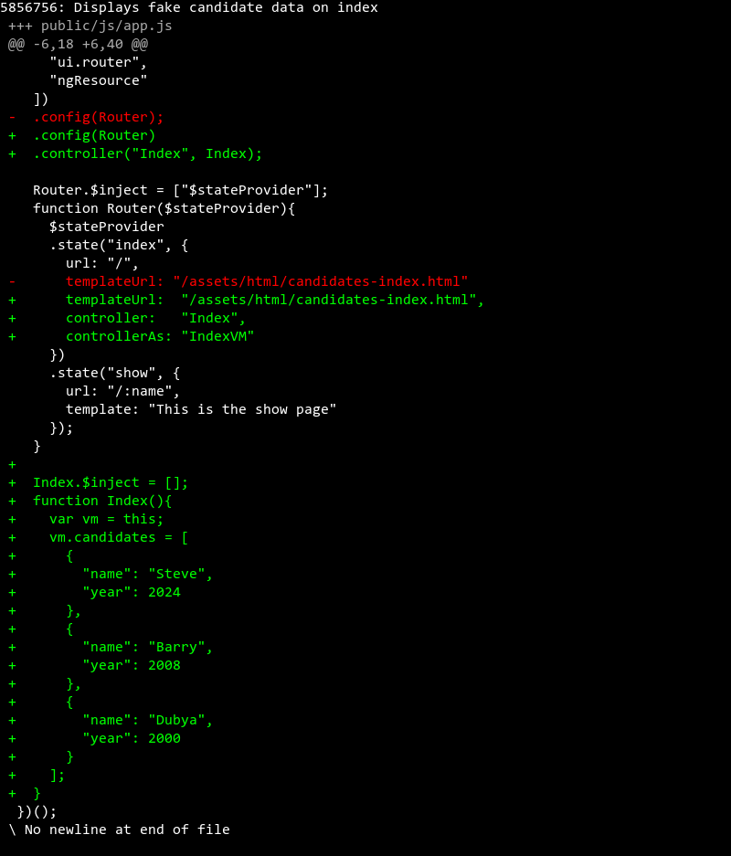

# Displays actual candidate data from database

> [9c37807](https://www.github.com/ga-wdi-exercises/whenpresident/commit/9c37807)

**Questions**:

<!-- Q: api namespace  -->
<details>
<summary>
Why might it be a good idea to namespace our back-end routes under `api`?
</summary>
<br>
```
To avoid confusion between routes meant to serve html, and routes whose purpose it is to render our app's data as JSON
```
<br>
<br>
</details>

<!-- Q: Delete response  -->
<details>
<summary>
What is the significance of the response for our `delete` request?
</summary>
<br>
```
To provide a clue to the client that the request went through, and the delete was processed
```
<br>
<br>
</details>

<!-- Q: Update response  -->
<details>
<summary>
What is returned from our `put` request?
</summary>
<br>
```
A JSON object with our updated candidate's info!
```
<br>
<br>
</details>

### [Displays actual candidate data from database: `index.js`](https://www.github.com/ga-wdi-exercises/whenpresident/blob/9c37807/index.js)
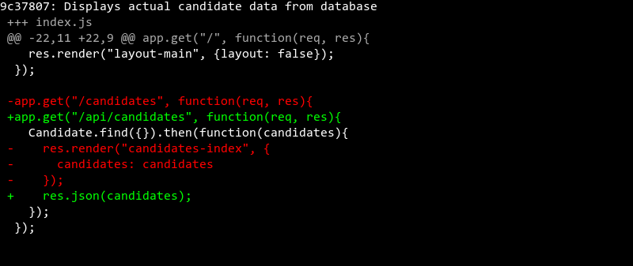

### [Displays actual candidate data from database: `public/js/app.js`](https://www.github.com/ga-wdi-exercises/whenpresident/blob/9c37807/public/js/app.js)
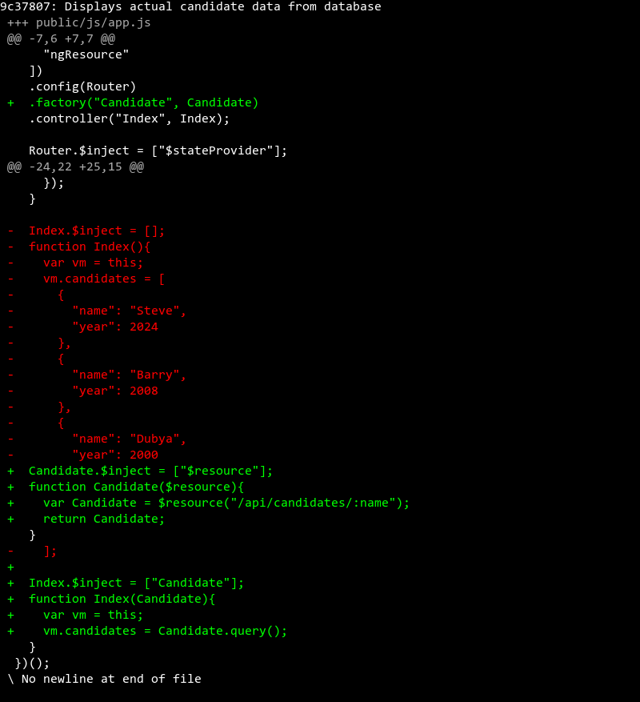

# Show route seems to query api successfully

> [c73089c](https://www.github.com/ga-wdi-exercises/whenpresident/commit/c73089c)

### [Show route seems to query api successfully: `index.js`](https://www.github.com/ga-wdi-exercises/whenpresident/blob/c73089c/index.js)
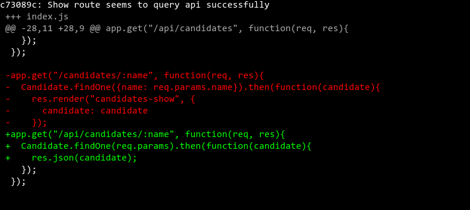

### [Show route seems to query api successfully: `public/html/candidates-show.html`](https://www.github.com/ga-wdi-exercises/whenpresident/blob/c73089c/public/html/candidates-show.html)
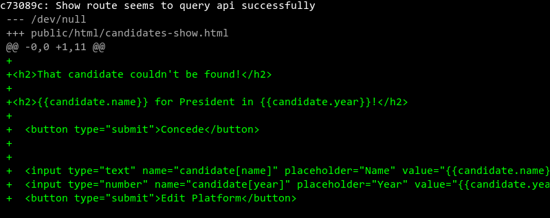

### [Show route seems to query api successfully: `public/js/app.js`](https://www.github.com/ga-wdi-exercises/whenpresident/blob/c73089c/public/js/app.js)
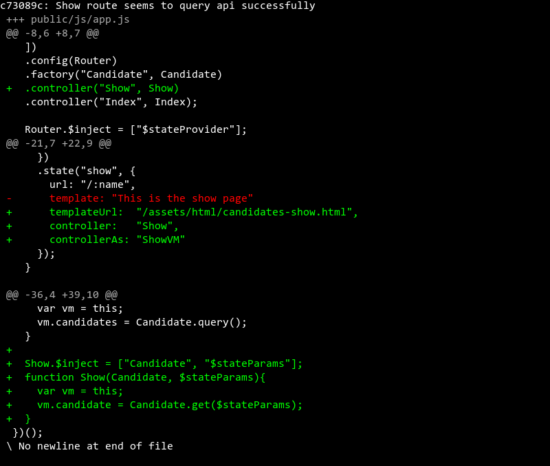

# Made Show page display correct data without errors

> [32f0878](https://www.github.com/ga-wdi-exercises/whenpresident/commit/32f0878)

### [Made Show page display correct data without errors: `public/html/candidates-show.html`](https://www.github.com/ga-wdi-exercises/whenpresident/blob/32f0878/public/html/candidates-show.html)
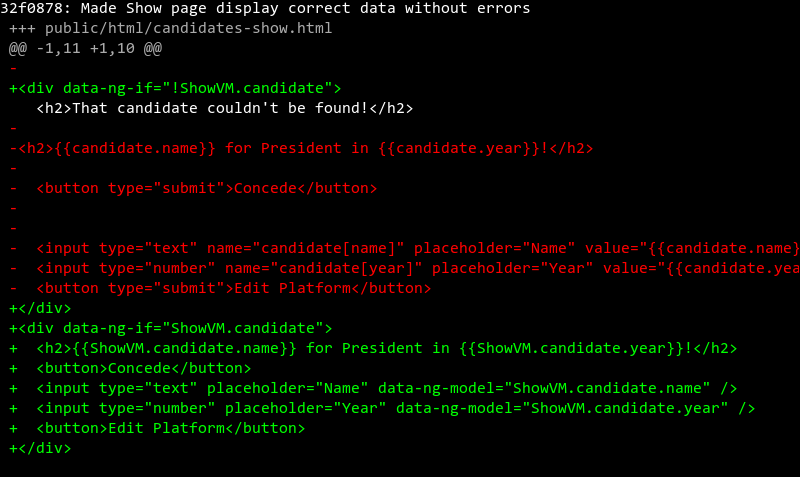

# Added HTML5 mode

> [24562d8](https://www.github.com/ga-wdi-exercises/whenpresident/commit/24562d8)

**Questions**:

<!-- Q. Root Route  -->
<details>
<summary>
 What does changing the root route definition to `("/*")` do and why is it important for our app?
</summary>
<br>
```
We add the wildcard to our route, the `*`, so that all combinations of routes hit via the url manually will trigger our Angular SPA and allow us to use Angular's `html5Mode` to take over routing
```
<br>
<br>
</details>
**Questions**:

<!-- Q. $urlRouterProvider.otherwise -->
<details>
<summary>
 What is the importance of the argument to `$urlRouterProvider.otherwise`?
</summary>
<br>
```
The url to redirect to if any request does not match our app's defined states
```
<br>
<br>
</details>

<!-- Q. $urlRouterProvider.otherwise -->
<details>
<summary>
  If you had to guess, when is `$urlRouterProvider` activated?
</summary>
<br>
```
$urlRouterProvider is activated any time a state transition is made
```
<br>
<br>
</details>

### [Added HTML5 mode: `index.js`](https://www.github.com/ga-wdi-exercises/whenpresident/blob/24562d8/index.js)
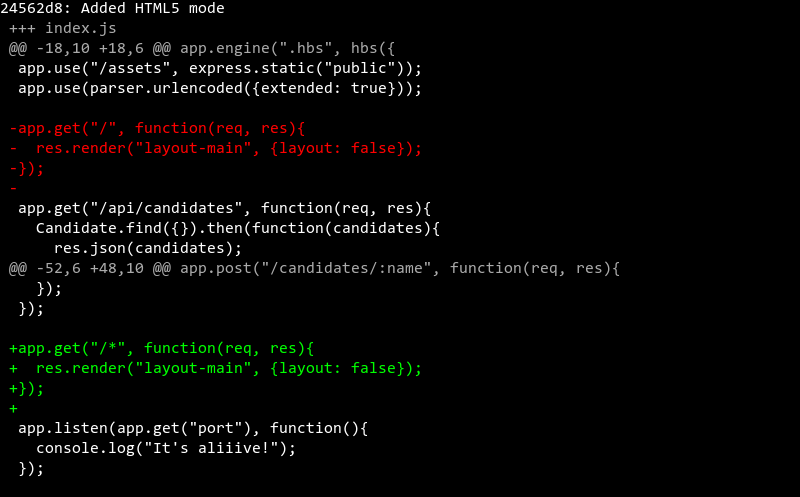

### [Added HTML5 mode: `public/js/app.js`](https://www.github.com/ga-wdi-exercises/whenpresident/blob/24562d8/public/js/app.js)
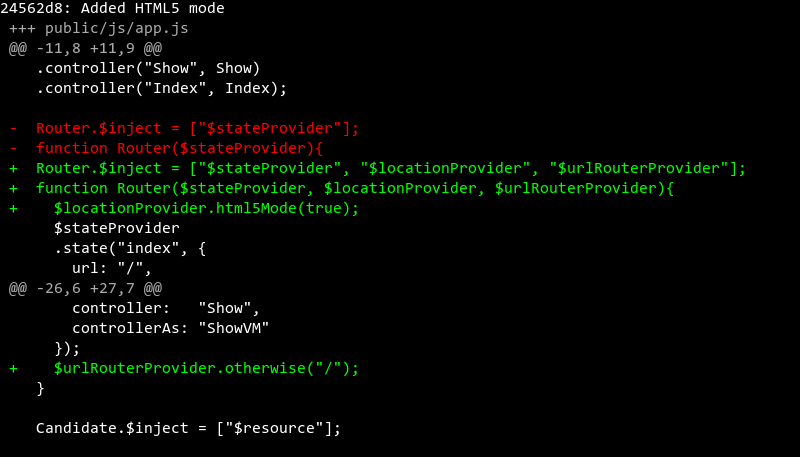

### [Added HTML5 mode: `views/layout-main.hbs`](https://www.github.com/ga-wdi-exercises/whenpresident/blob/24562d8/views/layout-main.hbs)
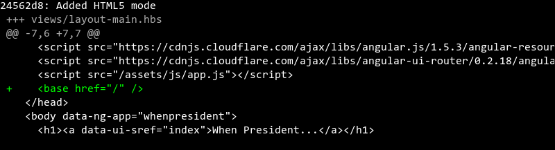

# Added candidate create functionality

> [0d6d1b4](https://www.github.com/ga-wdi-exercises/whenpresident/commit/0d6d1b4)

**Questions**:

<!-- Q: body-parser  -->
<details>
<summary>
 What role does `body-parser` play in our application?
</summary>
<br>
```
Body-Parser is necessary middleware that allows us to access the body of post requests from ajax requests and html form submissions. In our app, we use to parse the request's body as JSON.
 ```
 <br>
 <br>
</details>

### [Added candidate create functionality: `index.js`](https://www.github.com/ga-wdi-exercises/whenpresident/blob/0d6d1b4/index.js)
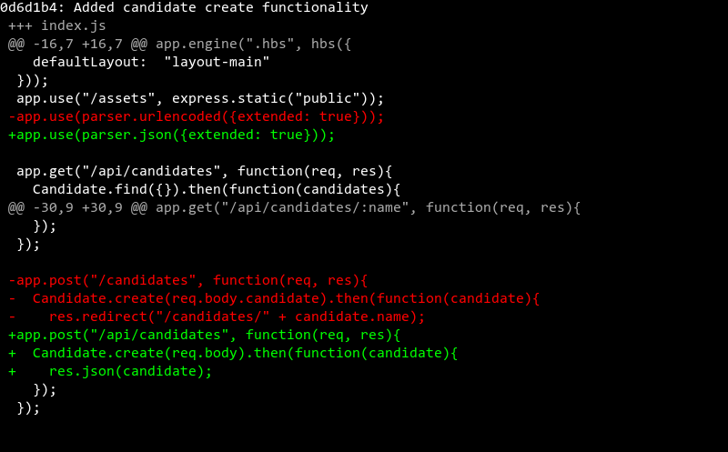

### [Added candidate create functionality: `public/html/candidates-index.html`](https://www.github.com/ga-wdi-exercises/whenpresident/blob/0d6d1b4/public/html/candidates-index.html)
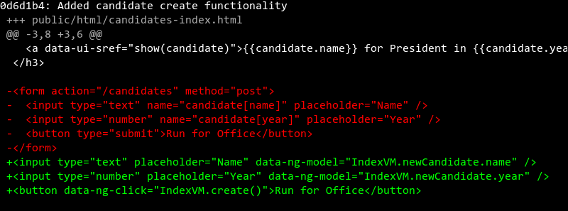

### [Added candidate create functionality: `public/js/app.js`](https://www.github.com/ga-wdi-exercises/whenpresident/blob/0d6d1b4/public/js/app.js)
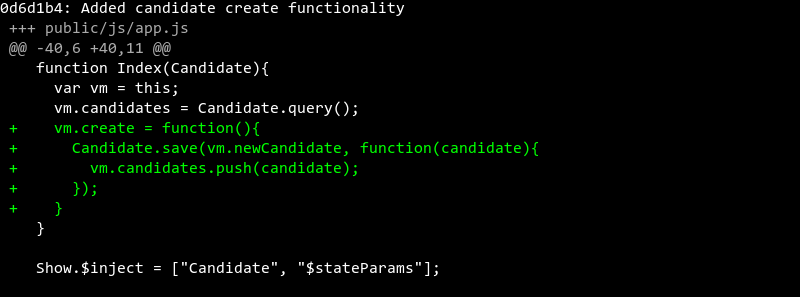

# Added candidate update functionality

> [907cbaf](https://www.github.com/ga-wdi-exercises/whenpresident/commit/907cbaf)

**Questions**:

<!-- Q: two-way data-binding  -->
<details>
<summary>
 What is two-way data-binding in Angular?
</summary>
<br>
```
Two-way data-binding in Angular apps is the automatic synchronization of data between the model and view components via viewmodels.
 ```
 <br>
 <br>
</details>

<!-- Q: alternate syntax for Update -->
<details>
<summary>
 What is an alternate syntax to make an `update` call in Angular ?
</summary>
<br>
We can call an instance method as well:
```
  vm.update = function (){
    vm.candidate.$update().then(function(candidate){
        vm.candiidate = candidate
      })
  }
 ```
 <br>
 <br>
</details>

### [Added candidate update functionality: `index.js`](https://www.github.com/ga-wdi-exercises/whenpresident/blob/907cbaf/index.js)
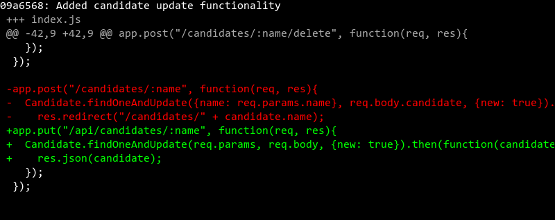

### [Added candidate update functionality: `public/html/candidates-show.html`](https://www.github.com/ga-wdi-exercises/whenpresident/blob/907cbaf/public/html/candidates-show.html)
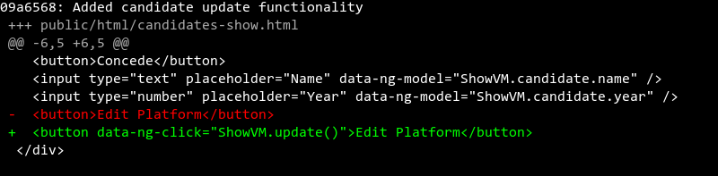

### [Added candidate update functionality: `public/js/app.js`](https://www.github.com/ga-wdi-exercises/whenpresident/blob/907cbaf/public/js/app.js)
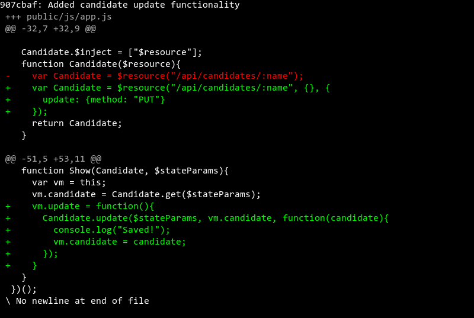

# Can delete candidate from database

> [b69572d](https://www.github.com/ga-wdi-exercises/whenpresident/commit/b69572d)

### [Can delete candidate from database: `index.js`](https://www.github.com/ga-wdi-exercises/whenpresident/blob/b69572d/index.js)
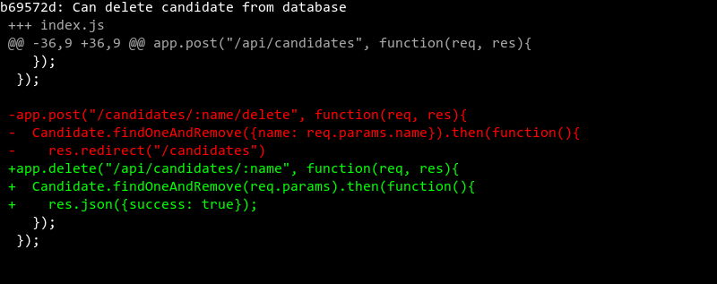

### [Can delete candidate from database: `public/html/candidates-show.html`](https://www.github.com/ga-wdi-exercises/whenpresident/blob/b69572d/public/html/candidates-show.html)
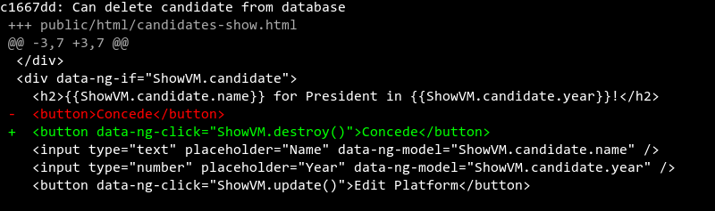

### [Can delete candidate from database: `public/js/app.js`](https://www.github.com/ga-wdi-exercises/whenpresident/blob/b69572d/public/js/app.js)
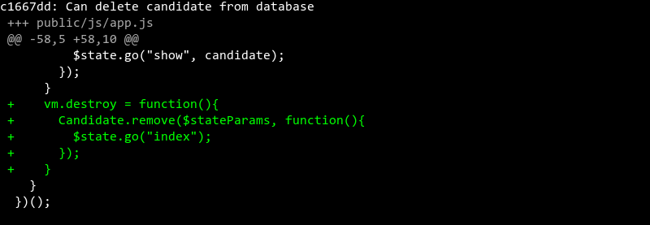


